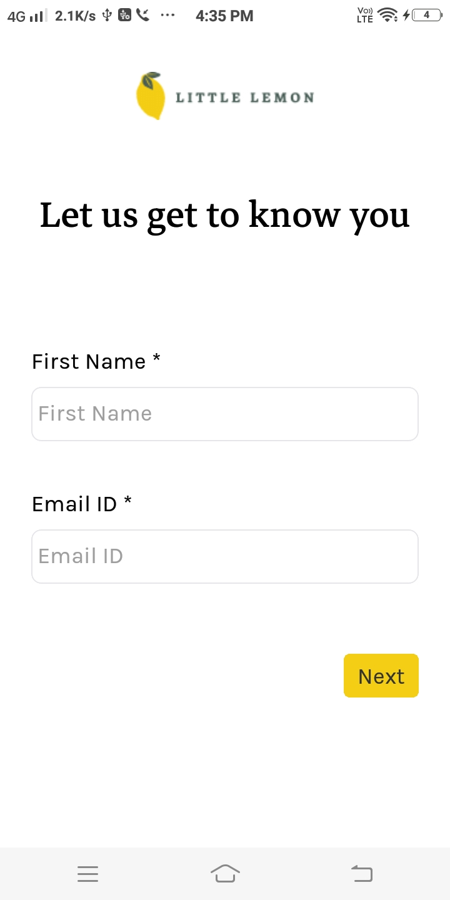
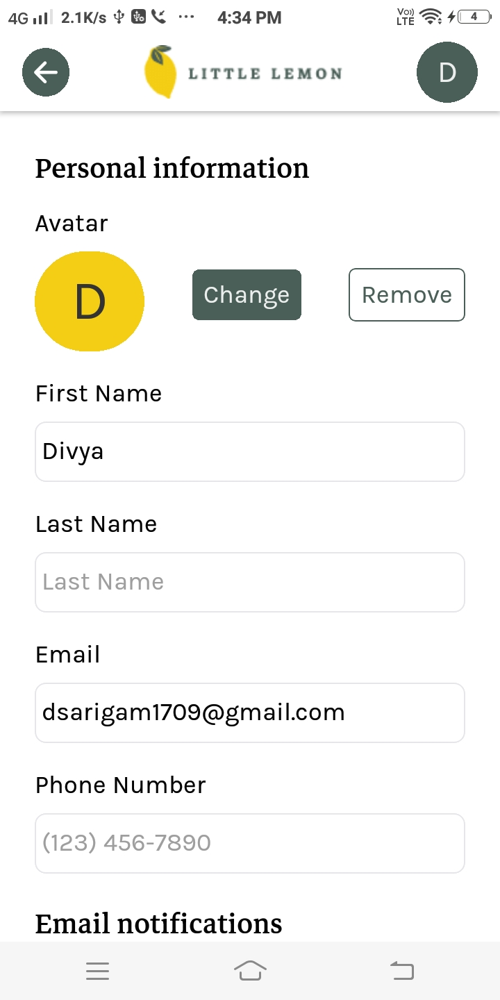
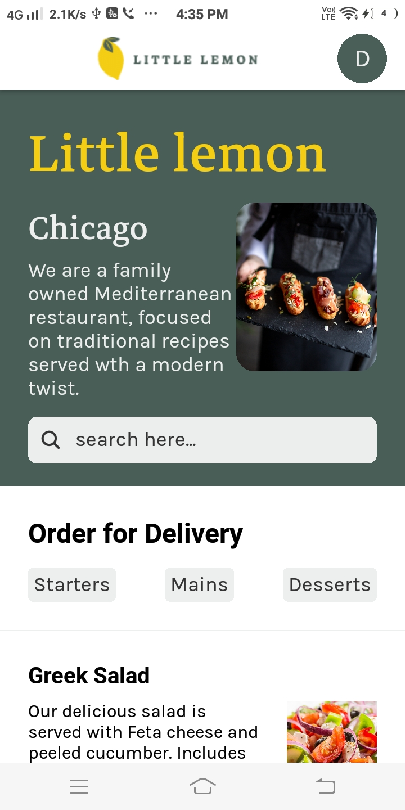

# 🍋 Little Lemon Restaurant — React Native App

A mobile application for the fictional **Little Lemon Restaurant**, built as the capstone project for the Meta React Native Specialization.  
This app allows users to browse the menu, search & filter dishes, and place orders with a clean, responsive UI.

---

## ✨ Features
- 📝 **User Registration**
  - Register as a new user with name, email, and other details.

- 👤 **Profile Screen**
  - View and update user profile information.

- 🏠 **Home Screen**
  - 🔍 Search dishes by name (supports partial letter search).
  - 📂 Filter dishes by category.
  - 📋 View a list of dishes with their name, description, and price.

## 📷 Screenshots
<!-- 

 -->

  
  
  

## 📄 License
This project was developed as part of the Meta React Native Specialization on Coursera. 
For educational & portfolio purposes only.

